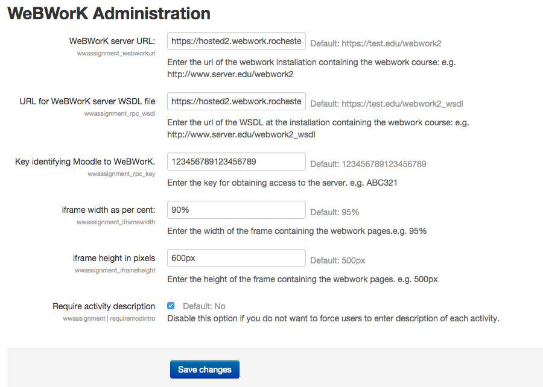

#INSTALL and CONFIGURE

###Installation 

Iinstallation of the moodle modules is very quick:

Quick install **wwlink**:

1. cd moodle/blocks
2. git clone https://github.com/openwebwork/wwassignment.git

Quick install **wwassignment**:

1. cd moodle/mod
2. git clone https://github.com/openwebwork/wwlink.git

### Moodle site configuration

1. Log in as a site administrator
2. From Site administration -> Notification update the database to include the new module **wwassignment** and the new block **wwlink**
3. Go to Site administration-> Plugins -> Activity modules -> WeBWorK Administration
4. Fill in the form as shown below.  You can use the http://hosted2.webwork.rochester.edu site to test the initial installation but it is not a good idea to use it for production work.  It is a development machine and it may be taken off line or its software may be changed drastically and without warning.
5. The full URLs for the test site are
  1. WeBWorK server URL: https://hosted2.webwork.rochester.edu/webwork2
  2. URL for WeBWorK server WSDL file: https://hosted2.webwork.rochester.edu/webwork2_wsdl 
6. You can test whether a server is up and running by typing the WSDL url into a browser window. A large XML file should be returned which defines the SOAP interface of the server.




### Moodle course configuration
1. Log in as an administrator in a course
2. Click on "Turn editing on" in the upper right corner.
3. Click on "add a block" and add the wwlink block to the course.
4. You can reposition the block where you wish on the page.
5. Click on the wheel in the block entitled WEBWORK LINK and choose "configure WeBWorK link block" from the menu
6.  The "select a webwork course" popup menu lists all of the WeBWorK courses available at the WeBWorK site.  
7.  Choose the WeBWorK course you wish to connect to this Moodle course. For testing you can choose one of maa1xx on the hosted2 site.  (For later use -- the login "profa" with password "profa" will give you professor access to the maa1xx webwork course. Do not expect anything to be preserved on any of these courses. They are erased and reconstructed periodically.)
8.  Save changes
9.  The moodle course and the webwork course are now connected to each other.

### Adding a webwork assignment
1. Login in as an instructor in a course.
2. Click on "turn editing on" in the upper right corner.
3. Click on "Add an activity or resource" in any section of the home page and select "WeBWorK Problem Set"
4. Click "Add" at the bottom of the page
5. The WeBWorK Set popup menu allows you to choose one of the assignments that has been prepared in the WeBWorK course.
6. Fill in the moodle name for the assignment, the description and other information.
7. Press Save and return to course
8. The WeBWorK spiderweb icon will automatically link the student to their version of the assignment. 
9. If you wish to modify assignment dates you need to edit the WeBWorK Problem Set link and use the links "Go to WeBWorK instructor tools" or "Modify Set" to sign in to the WeBWorK site. (You need instructor privileges and may need to use the profa/profa login/password if you are using the test site.)
10. Grades from WeBWorK homework are automatically entered into the moodle grade book whenever the Moodle cron job is run.
11. Further details on working with WeBWorK are beyond the scope of these instructions.  For more help:
    1. See the webwork wiki http://webwork.maa.org/wiki in general, 
    2. See http://webwork.maa.org/wiki/Homework_Sets specifically 
    3. Search other pages in the wiki with the search bar.
    4. Ask questions on the **WeBWorK forum** linked to from the left margin of the wiki pages. 


### Enabling the WeBWorK server

Installation of the WeBWorK software is beyond the scope of this document.  You can
use the install script https://github.com/openwebwork ww_install in many cases, 
particularly if you are installing on a machine from scratch.  
For more information search the  WeBWorK wiki http://webwork.maa.org/wiki  for the term "install".

When the WeBWorK site is initially set up it may not have its webservice 
capability turned on. To turn them on we need to make adjustments to the 
configuration files in the directory  `.../webwork2/conf`. The files that 
end in .dist are distribution files which are not active, 
e.g  `webwork.apache2.4-config.dist`.  To make this configuration 
file active copy it to `webwork.apache2.4-config`.  

* If you are using apache2.4 or later then you should use the configuration file `webwork.apache2.4-config`.  
* Uncomment the following stanzas to enable the SOAP interface which connects WeBWorK and Moodle.

  
```
####################################################################
# WebworkSOAP handlers (for integration with moodle)
####################################################################

 PerlModule WebworkSOAP

 # WEBWORK SOAP CONFIGURATION
 <Location /webwork2_rpc>
         PerlHandler Apache::SOAP
         SetHandler perl-script
         PerlSetVar dispatch_to "WebworkSOAP"
         PerlSetVar options "compress_threshold => 10000"
         Require all granted
 </Location>

####################################################################
# WebworkSOAP WSDL HANDLER :: TO BE REPLACED WITH A FILE FOR PRODUCTION SERVERS
####################################################################
 <Location /webwork2_wsdl>
         PerlSetVar dispatch_to "WebworkSOAP::WSDL"
         PerlSetVar options "compress_threshold => 10000"
         PerlHandler WebworkSOAP::WSDL
         SetHandler perl-script
         Require all granted
 </Location>

```
* If you are using earlier versions of apache2  then you should use the config file `webwork.apache2-config` and uncomment the following stanzas

```
####################################################################
# WebworkSOAP handlers (for integration with moodle)
####################################################################
 PerlModule WebworkSOAP

 # WEBWORK SOAP CONFIGURATION
 <Location /webwork2_rpc>
         PerlHandler Apache2::SOAP
         SetHandler perl-script
         PerlSetVar dispatch_to "WebworkSOAP"
         PerlSetVar options "compress_threshold => 10000"
         Order Allow,Deny
         Allow from All
 </Location>

####################################################################
# WebworkSOAP WSDL HANDLER :: TO BE REPLACED WITH A FILE FOR PRODUCTION SERVERS
####################################################################
 <Location /webwork2_wsdl>
         PerlSetVar dispatch_to "WebworkSOAP::WSDL"
         PerlSetVar options "compress_threshold => 10000"
         PerlHandler WebworkSOAP::WSDL
         SetHandler perl-script
         Order Allow,Deny
         Allow from All
 </Location>
 ```
